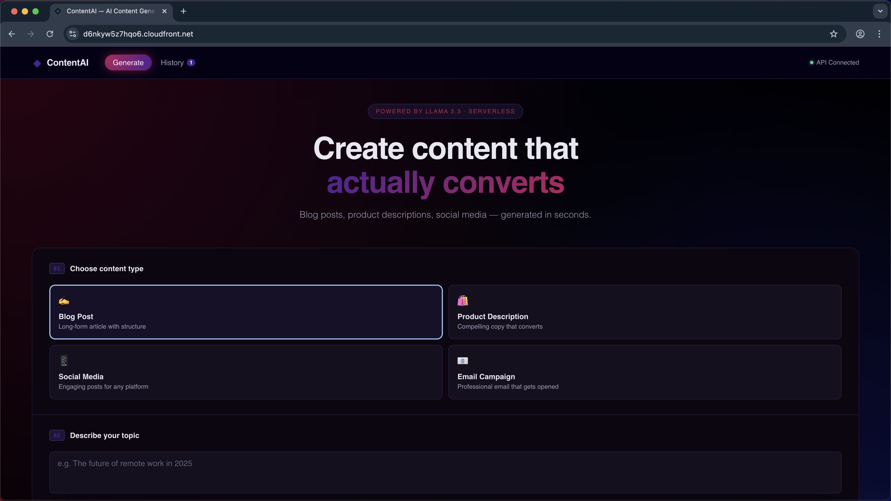
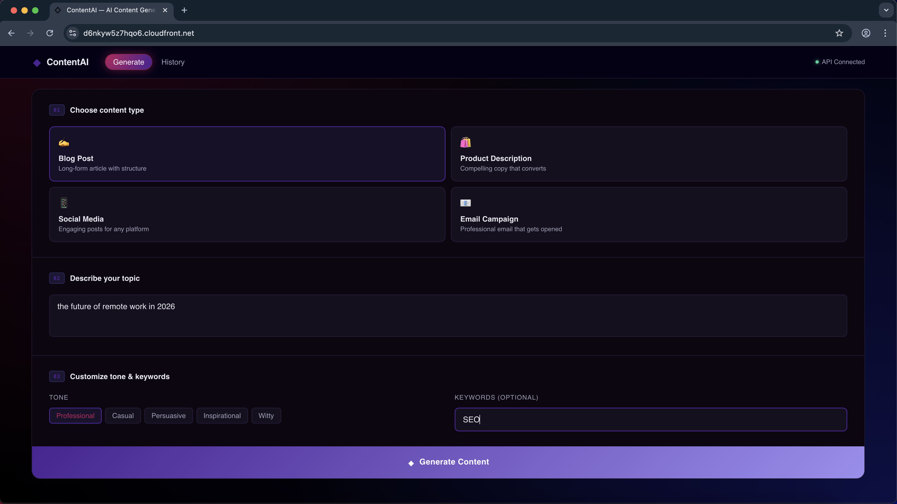
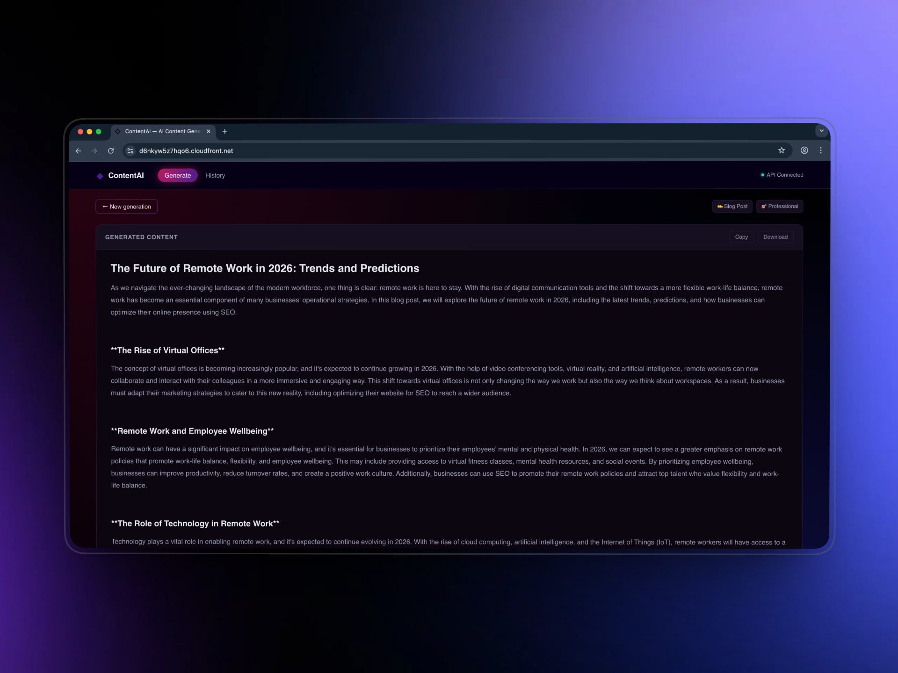
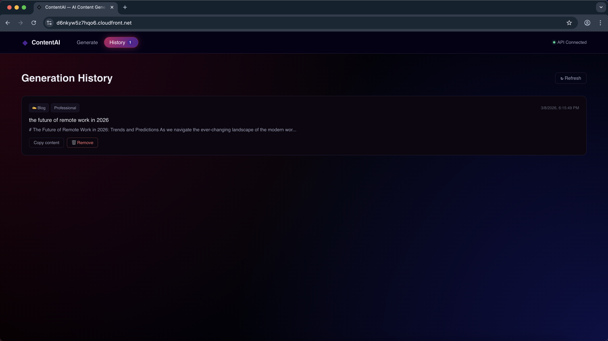
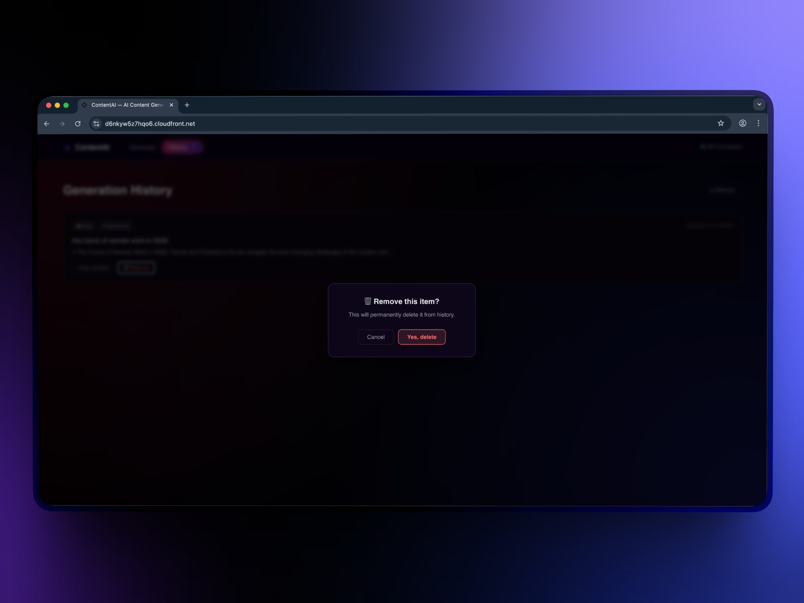
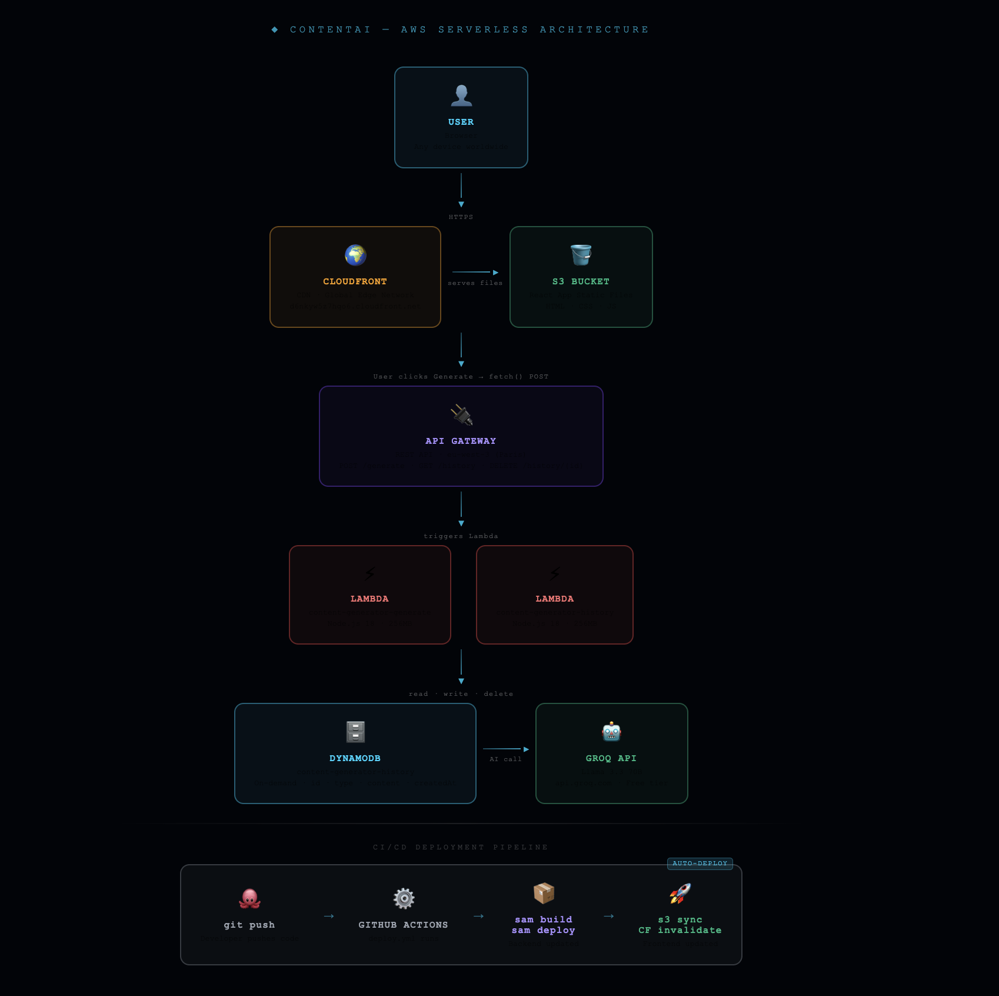

# ◆ ContentAI — Serverless AI Content Generator

> Generate professional blog posts, product descriptions, social media content, and email campaigns in seconds — powered by Llama 3.3 70B, built entirely on AWS serverless infrastructure.

🌍 **Live Demo:** [https://d6nkyw5z7hqo6.cloudfront.net](https://d6nkyw5z7hqo6.cloudfront.net)

<!-- 📸 SCREENSHOT INSTRUCTION:
     Take a screenshot of your live app at https://d6nkyw5z7hqo6.cloudfront.net
     Save it as: docs/screenshots/hero.png
     Then uncomment the line below:
-->
<!--  -->

---

## 📸 Screenshots

| Home | Generate |
|------|----------|
|  |  |

| Result | History |
|--------|---------|
|  |  |

| Delete Confirmation |
|---------------------|
|  |

---

## ✨ Features

- **4 Content Types** — Blog posts, product descriptions, social media posts, email campaigns
- **5 Tone Options** — Professional, Casual, Persuasive, Inspirational, Witty
- **Keyword Integration** — Inject SEO keywords into generated content
- **Persistent History** — Every generation saved to DynamoDB, survives page refresh
- **Delete with Confirmation** — Remove history items with confirmation dialog + toast notification
- **Copy & Download** — Export content as plain text instantly
- **Fully Serverless** — Zero servers to manage, scales automatically
- **CI/CD Pipeline** — Auto-deploys on every `git push` via GitHub Actions

---

## 🏗️ Architecture


---

## 🛠️ Tech Stack

### AWS Services
| Service | Role | Why |
|---------|------|-----|
| **Lambda** | Runs content generation + history logic | Serverless — pay per request, zero idle cost |
| **API Gateway** | REST API `/generate` `/history` `/history/{id}` | Managed routing, CORS, scales automatically |
| **DynamoDB** | Stores all generations | On-demand billing, single-digit ms reads |
| **S3** | Hosts compiled React frontend | Infinitely scalable static hosting |
| **CloudFront** | CDN + HTTPS for frontend | Global edge caching, free SSL certificate |
| **IAM** | Lambda permissions | Least-privilege access to DynamoDB only |
| **CloudWatch** | Lambda logs | Real-time debugging and monitoring |
| **CloudFormation** | Manages all resources as a stack | One command to create or delete everything |

### AI & Backend
| Service | Role |
|---------|------|
| **Groq API** | Llama 3.3 70B inference — generates all content |
| **Node.js 18** | Lambda runtime — no external AI SDK, uses native `https` module |

### Frontend
| Tool | Role |
|------|------|
| **React 18** | UI framework |
| **Vite** | Build tool — fast dev server + optimized production builds |
| **CSS Variables** | Theming — dark purple/pink design system |

### DevOps
| Tool | Role |
|------|------|
| **AWS SAM CLI** | Infrastructure as Code — deploys all AWS resources from `template.yaml` |
| **AWS CLI** | S3 sync, CloudFront invalidation, stack management |
| **GitHub Actions** | CI/CD — auto-deploys backend + frontend on every push to `main` |

---

## 📁 Project Structure

```
ai-content-generator/
├── frontend/                      # React application
│   ├── src/
│   │   ├── App.jsx                # Main component — all UI + API calls
│   │   └── main.jsx               # React entry point
│   ├── index.html
│   ├── vite.config.js
│   └── package.json
│
├── backend/
│   └── lambda/
│       ├── generate/              # Content generation Lambda
│       │   ├── index.js           # Calls Groq API, saves to DynamoDB
│       │   └── package.json
│       └── history/               # History management Lambda
│           ├── index.js           # GET all items, DELETE by id
│           └── package.json
│
├── infrastructure/
│   └── template.yaml              # AWS SAM — defines ALL AWS resources
│
├── .github/
│   └── workflows/
│       └── deploy.yml             # GitHub Actions CI/CD pipeline
│
├── .gitignore
└── README.md
```

---

## 🚀 Deploy Your Own

### Prerequisites
- AWS Account with CLI configured (`aws configure`)
- SAM CLI installed
- Node.js 18+
- Free [Groq API key](https://console.groq.com)

### Step 1 — Clone & Install
```bash
git clone https://github.com/YOUR_USERNAME/ai-content-generator.git
cd ai-content-generator

cd backend/lambda/generate && npm install
cd ../history && npm install
cd ../../..
```

### Step 2 — Deploy Backend
```bash
cd infrastructure
sam build --template template.yaml
sam deploy --guided
```

Answer the prompts:
```
Stack Name: content-generator-stack
AWS Region: eu-west-3
Parameter GroqApiKey: your_gsk_key_here
Parameter AIModel: llama-3.3-70b-versatile
Parameter MaxTokens: 1000
```

### Step 3 — Get Your URLs
```bash
aws cloudformation describe-stacks \
  --stack-name content-generator-stack \
  --query "Stacks[0].Outputs" \
  --output table \
  --region eu-west-3
```

Copy `APIGatewayURL` and `FrontendBucketName` from the output.

### Step 4 — Deploy Frontend
```bash
cd frontend
VITE_API_URL=https://YOUR_API_URL.execute-api.eu-west-3.amazonaws.com/prod npm run build
aws s3 sync dist/ s3://YOUR_BUCKET_NAME --delete --region eu-west-3
```

### Step 5 — Invalidate CloudFront Cache
```bash
aws cloudfront create-invalidation \
  --distribution-id $(aws cloudfront list-distributions \
    --query "DistributionList.Items[0].Id" --output text) \
  --paths "/*"
```

### Step 6 — Setup CI/CD (GitHub Actions)
Add these secrets to your GitHub repo → Settings → Secrets → Actions:

| Secret | Value |
|--------|-------|
| `AWS_ACCESS_KEY_ID` | Your AWS access key |
| `AWS_SECRET_ACCESS_KEY` | Your AWS secret key |
| `GROQ_API_KEY` | Your `gsk_...` Groq key |
| `API_GATEWAY_URL` | Your API Gateway URL |

Now every `git push` to `main` auto-deploys everything. ✅

---

## 💰 Cost Breakdown

| Service | Free Tier | Estimated Cost |
|---------|-----------|----------------|
| Lambda | 1M requests/month free | ~$0.00 |
| API Gateway | 1M requests/month free | ~$0.003 |
| DynamoDB | 25GB + 25 WCU free | ~$0.00 |
| S3 | 5GB free | ~$0.00 |
| CloudFront | 1TB transfer free | ~$0.08 |
| Groq AI | Free tier | $0.00 |
| **Total** | | **~$0.10/month** |

> Costs only increase significantly beyond 100,000 requests/month (~$3-5/month).

---

## 🔌 API Reference

### POST `/generate`
Generate AI content.

**Request:**
```json
{
  "type": "blog",
  "topic": "The future of remote work",
  "tone": "Professional",
  "keywords": "productivity, async, flexibility"
}
```

**Response:**
```json
{
  "content": "# The Future of Remote Work\n\n...",
  "cached": false,
  "id": "3b05afbd-9f79-478a-a9f4-cdd58af9602d"
}
```

**Content types:** `blog` `product` `social` `email`
**Tones:** `Professional` `Casual` `Persuasive` `Inspirational` `Witty`

---

### GET `/history`
Fetch all past generations.

**Response:**
```json
{
  "items": [
    {
      "id": "3b05afbd...",
      "type": "blog",
      "topic": "Paris travel",
      "tone": "Professional",
      "content": "...",
      "createdAt": "2026-03-08T05:28:45.000Z"
    }
  ]
}
```

---

### DELETE `/history/{id}`
Permanently delete a generation from DynamoDB.

**Response:**
```json
{ "success": true }
```

---

## 🧠 Key Technical Decisions

**Why Groq instead of OpenAI?**
Groq offers a completely free tier with no credit card required. Llama 3.3 70B produces high-quality content comparable to GPT-4 for content generation tasks.

**Why SAM CLI instead of clicking in AWS Console?**
SAM CLI allows the entire infrastructure to be defined as code in `template.yaml`. This means the whole project can be deployed with two commands, deleted cleanly, and reproduced identically — which also enables GitHub Actions to auto-deploy without any human interaction.

**Why no external AI SDK in Lambda?**
The generate Lambda uses Node.js's built-in `https` module to call Groq's API directly. This avoids adding a large SDK dependency, reduces cold start time, and keeps the Lambda package smaller.

**Why CloudFront in front of S3?**
S3 alone doesn't support HTTPS on custom paths or SPA routing. CloudFront adds HTTPS, global edge caching, and handles React Router's client-side routing by returning `index.html` for all 404s.

---

## 🗑️ Teardown

To delete everything and stop all AWS charges:

```bash
# Empty S3 bucket first
aws s3 rm s3://content-generator-frontend-806026059485 --recursive --region eu-west-3

# Delete the entire stack (Lambda, API GW, DynamoDB, S3, CloudFront)
aws cloudformation delete-stack \
  --stack-name content-generator-stack \
  --region eu-west-3

# Delete CloudWatch logs
aws logs delete-log-group --log-group-name /aws/lambda/content-generator-generate --region eu-west-3
aws logs delete-log-group --log-group-name /aws/lambda/content-generator-history --region eu-west-3
```

---

## 👨‍💻 Author

Built by **Marouane Dagana** — Full Stack & Cloud Developer

- 🐙 GitHub: [@daganoo](https://github.com/daganoo)
- 💼 LinkedIn: [Marouane Dagana ](https://www.linkedin.com/in/marouane-dagana-418832264/)

---

## 📄 License

MIT License — feel free to use this project as a template for your own work.
